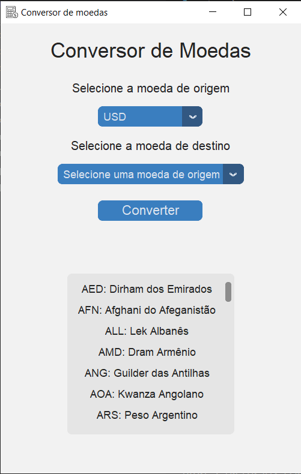

# Conversor de Moedas
Conversor de Moedas que permite converter valores monetários entre diversas moedas mundiais. Utilizando uma API para a obtenção de taxas de câmbio atuais e permite o usuário escolher a moeda de origem e a moeda destinatária.

# Funcionalidades 
Insersão de moeda de origem e a moeda destinatária.
Posse da taxa de câmbio, acesso à API de taxas.
Calculo da conversão das moedas.

# Instalação
Para instalar  o conversor de moedas, será necessário baixar o código e instalar as dependências necessárias, como a biblioteca para acesso à API de taxas de câmbio.

# Pré-requisitos
Extensão do Python Instalado no Visual Studio Code e o Visual Studio Code (Acesse o ícone de extensões (quadrados empilhados na barra à esquerda), digite “Python” na caixa de busca e instale a extensão feita pela Microsoft).

# Screenshots

# Aprendizados
Aprendemos o trabalho com API, que é a demonstração do conversor de moedas para obter dados.
Aprendemos também a calcular a conversão de moedas com base na taxa de câmbio. 

# Autores
Lucas Sekine Bocchi de Souza;
Igor Guimarães Gandolfi;
Thiago Martins Colombini;
Flávio José de Souza Nascimento.